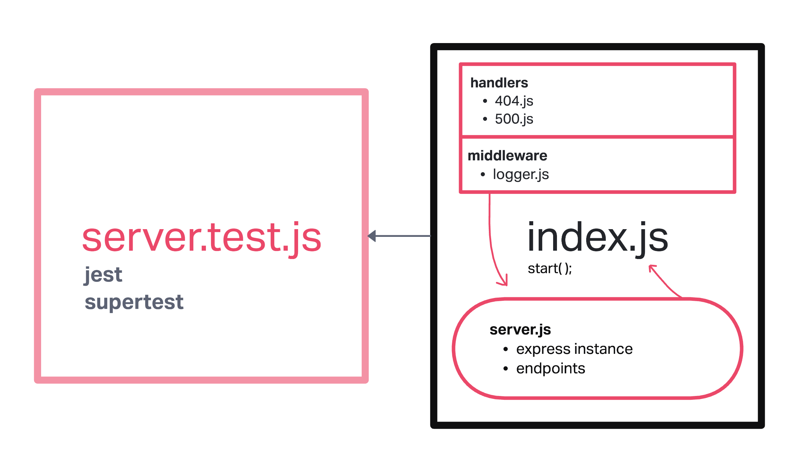

# LAB - Class 01

## Project: Server Deployment Practice

### Author: Dustin Apodaca

### Problem Domain

- To create and deploy a web server using CI and CD and get used to the general process of building and deploying servers.

### Links and Resources

- [ci/cd](http://xyz.com) (GitHub Actions)
- [prod deployment](http://xyz.com) (when applicable)
- [dev deployment](http://xyz.com) (when applicable)

### Setup

#### `.env` requirements (where applicable)

see `.env.sample`

- `PORT` - 3002

#### How to initialize/run your application (where applicable)

- nodemon

#### Features / Routes

- Feature One: Deploy to Dev
- GET : `/` - specific route to hit
- GET : `bad` - specific route to hit
- Feature One: Deploy to Prod
- GET : `/hello` - specific route to hit
- GET : `bad` - specific route to hit

#### Tests

- How do you run tests?
  - npm test
- Any tests of note?
  - handles root path
  - handles invalid requests
  - handles errors

#### UML

Link to an image of the UML for your application and response to events

